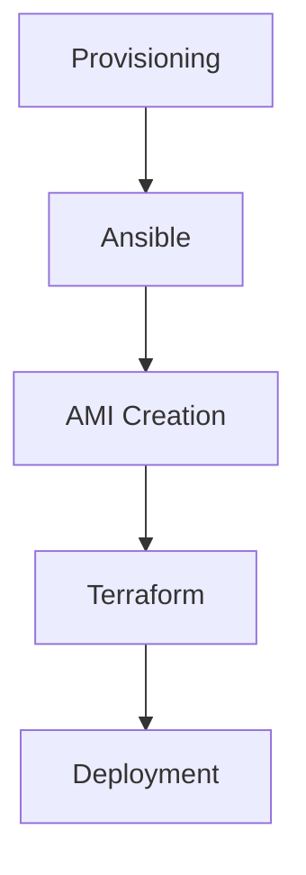

# AWS AMI Collection

This repository contains a collection of Amazon Machine Images (AMIs) for various runtimes and services on AWS using immutable infrastructure principles. 

## Architecture & Project Structure

We use the following tools to build and manage our AMIs:

- `Ansible`: For configuration management and provisioning of the AMIs. 
- `Terraform`: For infrastructure as code to manage AWS resources and automate the deployment of AMIs.
- `Packer`: For creating standardized AMIs across multiple platforms.

## Catalog of AMIs

See `./catalog.yml` for a complete list of available AMIs, including their configurations, supported runtimes, and associated services.
